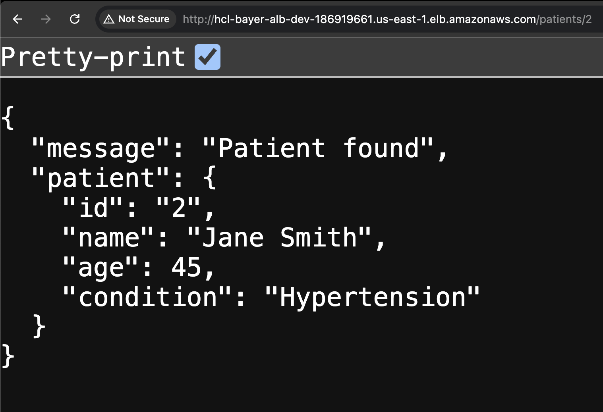
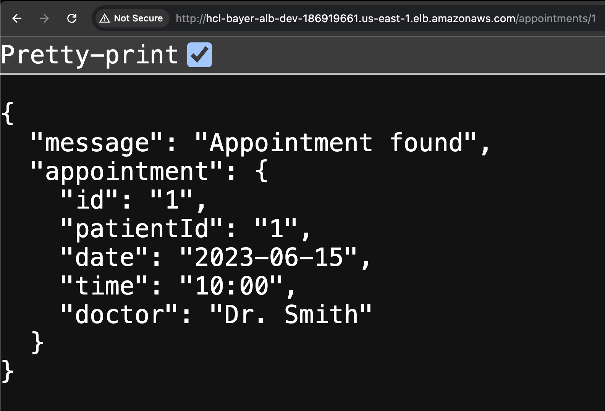

# DevOps Hackathon Challenge: Containerized Microservices Deployment 🚀

👋 **Hi there!** Thanks for checking out my project. I built this to show off my DevOps skills. Let’s get started!

## Project Requirements and Instructions 📋

Want the full details? Check these out:

- [Main Challenge Page](https://hackathon.baywsf.com/devops/index.html)
- [Fargate Track Details](https://hackathon.baywsf.com/devops/fargate-track.html)


## Project Overview 🌟

Here’s what I did:

- **Containerized** two microservices (**Patient** Service & **Appointment** Service) with Docker 🐳
- Used **Terraform** for Infrastructure as Code (IaC) 🛠️ to build the entire Infrasture.
- Set up **CI/CD** with **GitHub Actions** which automatically triggers on pull requests and push to main branch 🤖
- **Deployed** the microservices on **AWS ECS Cluster (Fargate)** 🚀
- Serves the traffic through **AWS ALB** ⛕
- Monitored everything with **AWS CloudWatch** 📊


## How to Run the Project 🛠️

### Prerequisites

- **AWS Account**: Set up an IAM user with limited permissions for S3, ALB, ECR, ECS, VPC, Security Groups, and CloudWatch.
- **Access Keys**: Generate AWS access keys for the IAM user to use in GitHub Actions.
- **GitHub Account**: You’ll need a github account to fork the project.

### Setup

1. **Fork the Repo**: Go to my GitHub repo and click "Fork".
2. Goto **Actions** > Cancel the **workflow** immediately. Because you need to add below **Secrets** under Repo settings.
3. **Terraform Backend**: Create new S3 bucket and Dynamodb Table for state management.
  ```
  # Create S3 bucket and Dynamodb Table
  aws s3api create-bucket --bucket <BUCKET_NAME> --region <AWS_REGION>
  
  aws dynamodb create-table -table-name <DYNAMODB_TABLE_NAME> \
    --attribute-definitions AttributeName=LockID,AttributeType=S \
    --key-schema AttributeName=LockID,KeyType=HASH \
    --provisioned-throughput ReadCapacityUnits=1,WriteCapacityUnits=1
  ```
2. Update with your S3 bucket (e.g., `project-bucket-tf-state`) and DynamoDB table (e.g., `project-dynamodb-tf-lock`) in `terraform/environments/dev/backend.tf` file.
4. **Add Secrets**: In your forked repo, go to **Settings > Secrets and variables > Actions** and add:
   - `AWS_ACCESS_KEY_ID`: Your AWS access key ID.
   - `AWS_SECRET_ACCESS_KEY`: Your AWS secret access key.
   - `ECR_REGISTRY`: Your AWS ecr URL (e.g., `aws_account_id.dkr.ecr.region.amazonaws.com`).
5. **Run It**: Finally Push some changes to your repo/main branch to trigger GitHub Actions which eventually creates the AWS Infra and Runs the project till the end! 💥


## Final Results 🎉

I have already ran & tested the project. ✅
➡️ Here’s the Screenshot of Load Balancer response for both Microservices:

**Patient Service:**
  

**Appointment Service:**
  

---

Thanks for checking out my project! Hope you like it! 😊
